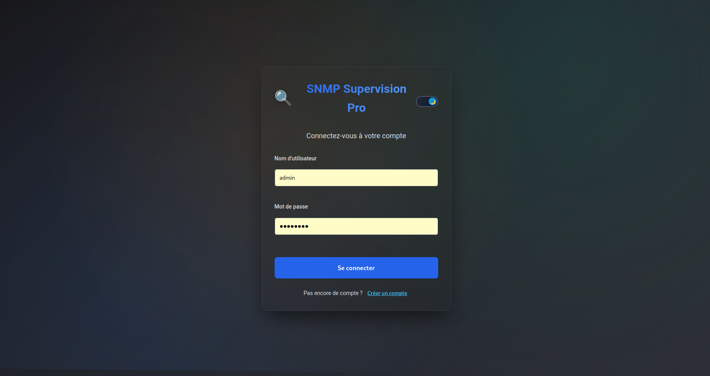
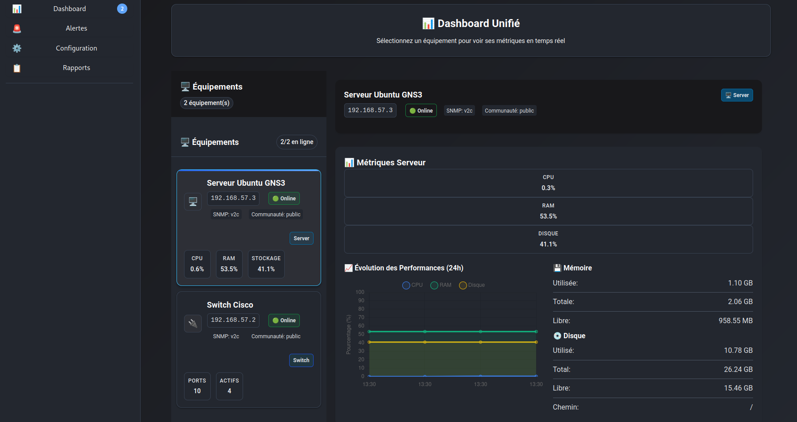
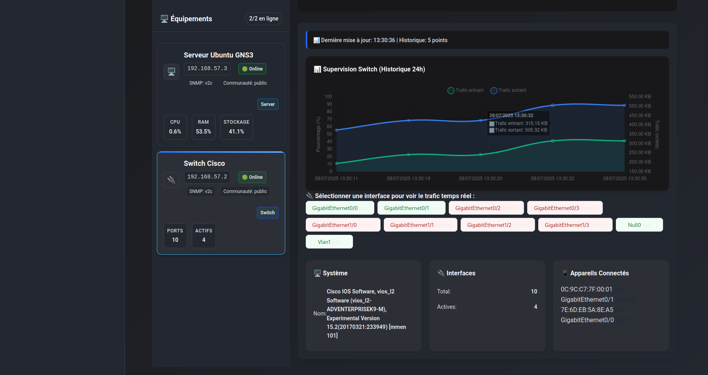
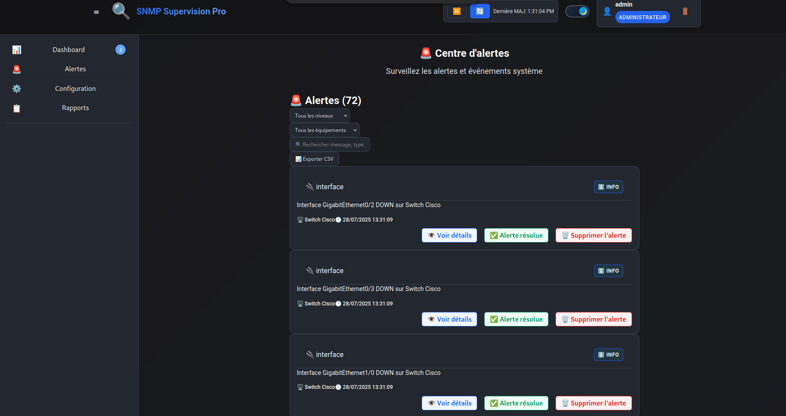
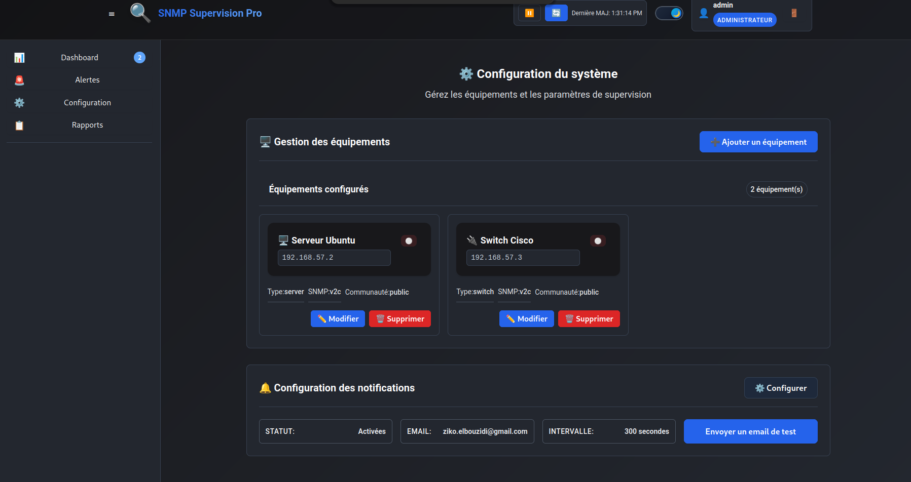
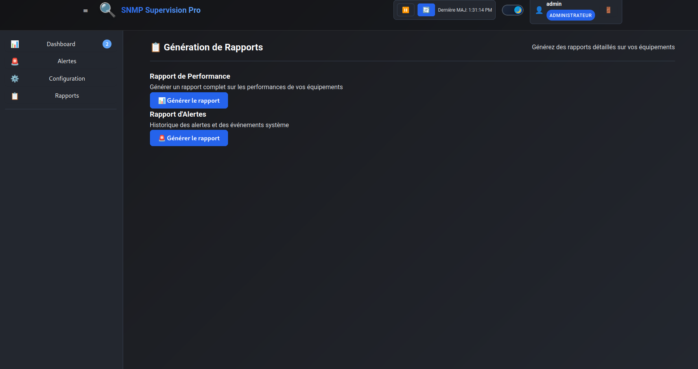
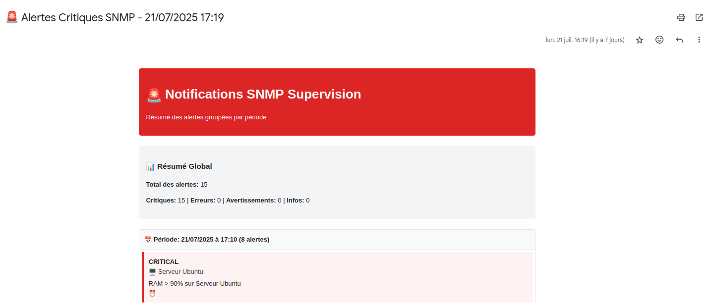
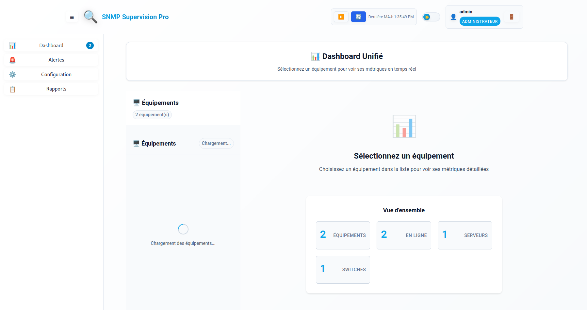

# SNMP Supervision

A modern SNMP monitoring system with real-time web interface for network equipment monitoring.

## Features

### Backend (FastAPI + Python)
- Complete REST API for SNMP management
- Server metrics: CPU, memory, disk in real-time
- Switch metrics: interfaces, traffic, connected devices
- Smart cache to optimize performance
- Robust error handling with automatic fallback
- Detailed logs for debugging

### Frontend (React + TypeScript)
- Modern dashboard with responsive interface
- Real-time charts for metrics
- Equipment management (add, modify, delete)
- Live monitoring of network interfaces
- Intuitive interface for SNMP configuration

## Screenshots

### Login Interface

The secure authentication interface with user login and registration capabilities.

### Dashboard - Server Monitoring

Real-time server metrics including CPU usage, memory consumption, and disk utilization with interactive charts.

### Dashboard - Switch Monitoring

Comprehensive switch interface monitoring showing port status, traffic statistics, and connected devices.

### Alerts Management

Centralized alert system displaying critical events, warnings, and system notifications with filtering and sorting capabilities.

### Configuration Panel

Equipment management interface for adding, editing, and configuring SNMP devices with detailed settings.

### Reports Generation

Automated report generation system for performance analysis and historical data visualization.

### Example Report

[Download ReportExample.pdf](ReportExample.pdf)

### Email Notifications

Email alert system configuration and management for critical event notifications.

### Dark Mode and Light Mode

The application supports both dark mode and light mode themes for user preference and accessibility.

## Prerequisites

- Python 3.12+
- Node.js 18+
- npm or yarn
- Git

## Installation

### 1. Clone the project
```bash
git clone <repository-url>
cd snmp-supervision0
```

### 2. Backend Configuration
```bash
cd backend
python3 -m venv venv
source venv/bin/activate  # Linux/Mac
# or
venv\Scripts\activate  # Windows
pip install -r requirements.txt
```

### 3. Frontend Configuration
```bash
cd frontend
npm install
```

## Startup

### Automatic startup (recommended)
```bash
./start.sh
```

### Manual startup

#### Backend
```bash
cd backend
source venv/bin/activate
python3 main.py
```

#### Frontend
```bash
cd frontend
npm start
```

## Access

- Dashboard: http://localhost:3000
- Backend API: http://localhost:8000
- API Documentation: http://localhost:8000/docs

## Stop

```bash
./stop.sh
```

## Project Structure

```
snmp-supervision0/
├── backend/
│   ├── api/              #API Routes
│   ├── database/         #DB Configuration
│   ├── models/           #Data Models
│   ├── services/         #SNMP Services
│   │   ├── snmp_base.py      #Common features
│   │   ├── snmp_server.py    #Server metrics
│   │   ├── snmp_switch.py    #Switch metrics
│   │   └── snmp_service.py   #Unified service
│   ├── main.py          #Entry point
│   └── requirements.txt  #Python dependencies
├── frontend/
│   ├── src/
│   │   ├── components/   #React components
│   │   └── services/     #API services
│   ├── package.json
│   └── tsconfig.json
├── start.sh             #Startup script
├── stop.sh              #Stop script
└── README.md
```

## Configuration

### Environment variables
Create a `.env` file in the `backend/` folder:

```env
DATABASE_URL=sqlite:///./snmp_supervision.db
SECRET_KEY=your-secret-key-here
SMTP_SERVER=smtp.gmail.com
SMTP_PORT=587
SMTP_USERNAME=your-email@gmail.com
SMTP_PASSWORD=your-app-password
```

### SNMP Configuration
- Community string: Default "public"
- SNMP Version: SNMPv2c
- Timeout: 1 second
- Retries: 0 (for speed)

## Available Metrics

### Servers
- CPU: Usage percentage with delta calculation
- Memory: Total, used, free (KB, MB, GB)
- Disk: Total space, used, free
- Equipment name: Automatic detection

### Switches
- Interfaces: Status, speed, traffic
- Connected devices: MAC addresses, ports, interfaces
- Traffic: Octets in/out, errors, throughput
- Topology: Automatic discovery

## API Endpoints

### Equipment
- `GET /api/v1/equipment` - Equipment list
- `POST /api/v1/equipment` - Add equipment
- `GET /api/v1/equipment/{id}` - Equipment details
- `PUT /api/v1/equipment/{id}` - Modify equipment
- `DELETE /api/v1/equipment/{id}` - Delete equipment

### Metrics
- `GET /api/v1/metrics/server/{ip}` - Server metrics
- `GET /api/v1/metrics/switch/{ip}` - Switch metrics
- `GET /api/v1/metrics/interface/{ip}/{index}` - Interface metrics

### Tests
- `GET /api/v1/test/connectivity/{ip}` - Connectivity test
- `GET /health` - API status

## Troubleshooting

### Backend won't start
1. Check Python 3.12+
2. Activate virtual environment
3. Install dependencies: `pip install -r requirements.txt`
4. Check port 8000 is free

### Frontend won't start
1. Check Node.js 18+
2. Install dependencies: `npm install`
3. Check port 3000 is free

### SNMP errors
1. Check network connectivity
2. Check community strings
3. Check SNMP permissions on equipment
4. Check logs: `tail -f snmp_debug.log`

## Logs

- Backend: `backend.log`
- SNMP: `snmp_debug.log`
- Frontend: Browser console

## License

This project is under MIT license.

**SNMP Supervision** - Modern and intuitive network monitoring
